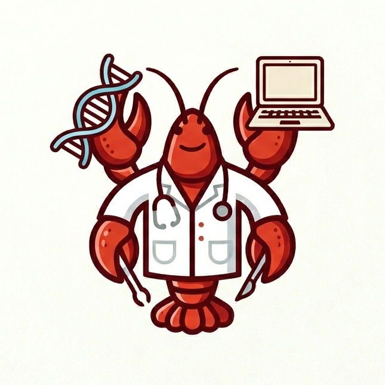

# FuxiClaw

**FuxiClaw** is a bioinformatics GUI agent application built on top of [OpenHarness](https://github.com/HKUDS/OpenHarness).

For the Chinese version of this document, see [README.md](README.md).

<p align="center">
  
</p>

<!-- Demo video placeholder -->

## Quick Start

Choose your platform:

- [macOS](#macos)
- [Windows (PowerShell)](#windows-powershell)

### macOS

> macOS only. The commands below assume a Unix-like shell on macOS.

The steps below are written for a first-time user who has just cloned this repository locally. When finished, you will have a GUI-based FuxiClaw setup, and the frontend agent will be able to use a local Docker-backed `bioinformatics` sandbox through OpenSandbox.

Before you begin, you can watch this Mac Quick Start demo video:

<video src="assets/demo/mac_demo.mp4" controls preload="metadata" width="100%">
  Your environment does not support inline playback. Use the MP4 link below instead.
</video>

If the video does not play inline, open [`assets/demo/mac_demo.mp4`](assets/demo/mac_demo.mp4) directly.

#### 1. Check local prerequisites

Make sure the following tools are already installed:

- Python `>= 3.10`
- Node.js `>= 18`
- Docker Desktop

You can verify them with:

```bash
python --version
node -v
npm -v
docker version
docker info
```

#### 2. Clone the repository and enter the project root

```bash
git clone <your-repo-url> FuxiClaw
cd FuxiClaw
```

If you have already cloned the repository, just `cd` into the project root.

#### 3. Check and prepare the bioinformatics Docker image

FuxiClaw uses the `bioinformatics` sandbox environment by default. Its image is:

```text
openharness/sandbox-bioinformatics:latest
```

The default environment definition lives at:

```text
src/openharness/sandbox/default_envs.yaml
```

First check whether the image already exists:

```bash
docker image ls | grep openharness/sandbox-bioinformatics
```

If you do not see `openharness/sandbox-bioinformatics:latest`, build it first:

```bash
docker build -t openharness/sandbox-bioinformatics:latest \
  -f src/openharness/sandbox/Dockerfile src/openharness/sandbox
```

What you need here is the Docker `image`. You do not need a pre-running `container` before starting the app.

It is best to do this early, because the `bioinformatics` image is the most important part of the sandbox runtime foundation.

#### 4. Create a virtual environment and install dependencies

```bash
python -m venv .venv
source .venv/bin/activate
pip install -U pip
pip install -e '.[opensandbox]'
pip install opensandbox-server

npm --prefix frontend/application-ui install
```

Notes:

- `.[opensandbox]` installs the GUI backend dependencies and the OpenSandbox SDK
- `opensandbox-server` is installed separately for the local Docker sandbox service

#### 5. Configure the model API

First copy the environment variable template:

```bash
cp .env.example .env
```

Then edit `.env` and fill in at least these values:

```bash
OPENAI_API_KEY=your_api_key
OPENAI_BASE_URL=https://api.openai.com/v1
OPENHARNESS_MODEL=gpt-4.1
```

If you use another OpenAI-compatible provider, replace the values accordingly. For example, for DeepSeek V4 Flash:

```bash
OPENAI_API_KEY=your_deepseek_api_key
OPENAI_BASE_URL=https://api.deepseek.com/v1
OPENHARNESS_MODEL=deepseek-v4-flash
OPENHARNESS_PROVIDER=DeepSeek
```

`scripts/dev_application_ui.sh` automatically loads `.env` from the repository root when it starts.

#### 6. Start OpenSandbox Server

Open a first terminal window and run:

```bash
cd FuxiClaw
source .venv/bin/activate
opensandbox-server
```

If you see a port-in-use error such as `127.0.0.1:8081 already in use`, you likely already have an `opensandbox-server` running. In that case, do not start a second one and just continue to the next step.

#### 7. Start the GUI

Open a second terminal window and run:

```bash
cd FuxiClaw
source .venv/bin/activate
scripts/dev_application_ui.sh
```

This script starts both:

- The GUI backend: `python -m openharness.web`
- The frontend dev server: Vite (`http://localhost:5173`)

#### 8. Open the browser

Open:

```text
http://localhost:5173/
```

After the UI loads, you can paste the following prompt into the frontend as a quick sandbox test:

```text
Please first inspect the currently available sandbox environments and enter the `bioinformatics` sandbox.

Then perform a quick bioinformatics environment audit inside this container with the following requirements:

1. Do not guess. You must verify everything by actually running commands.
2. Check and summarize whether the following are installed, and report their versions:
   - Python
   - R
   - Common command-line bioinformatics tools: samtools, bcftools, bedtools, bwa, bowtie2, minimap2, blastn, fastqc, multiqc, seqkit
3. For each tool, clearly label it as:
   - Installed + version
   - Not installed
4. Organize the results into a clear Markdown report.
5. Save the final report to:
   `/workspace/output/sandbox_bioinfo_audit.md`

If possible, also include the key commands you used for the inspection so I can reproduce them later.
```

#### Later restarts

Once the dependencies and Docker image are already prepared, future launches usually only require:

1. Open Docker Desktop
2. Run `opensandbox-server` in one terminal
3. Run `scripts/dev_application_ui.sh` in another terminal
4. Open `http://localhost:5173/`

### Windows (PowerShell)

> Windows only. The commands below assume native Windows, PowerShell, and Docker Desktop.

The steps below are written for a first-time user who has just cloned this repository locally. When finished, you will have a GUI-based FuxiClaw setup running in native Windows PowerShell, using OpenSandbox + Docker Desktop with the `bioinformatics` sandbox environment. Unlike macOS, Windows does not use `scripts/dev_application_ui.sh`; instead, it starts OpenSandbox Server, the web backend, and the Vite frontend in separate PowerShell windows.

Before you begin, you can watch this Windows Quickstart demo video:

<video src="assets/demo/win_demo.mp4" controls preload="metadata" width="100%">
  Your environment does not support inline playback. Use the MP4 link below instead.
</video>

If the video does not play inline, open [`assets/demo/win_demo.mp4`](assets/demo/win_demo.mp4) directly.

#### 1. Check local prerequisites

Make sure the following tools are already installed:

- Python `>= 3.10`
- Node.js `>= 18`
- Docker Desktop

You can verify them with:

```powershell
python --version
node -v
npm.cmd -v
docker version
docker info
```

Before continuing, manually start Docker Desktop and make sure `docker info` returns successfully.

If `docker version` or `docker info` fails, do not continue to the later OpenSandbox steps yet. Start Docker Desktop first and wait until it is ready.

#### 2. Clone the repository and enter the project root

```powershell
git clone <your-repo-url> FuxiClaw
cd FuxiClaw
```

If you have already cloned the repository, just `cd` into the project root.

#### 3. Check and prepare the bioinformatics Docker image

FuxiClaw uses the `bioinformatics` sandbox environment by default. Its image is:

```text
openharness/sandbox-bioinformatics:latest
```

The default environment definition lives at:

```text
src/openharness/sandbox/default_envs.yaml
```

First check whether the image already exists:

```powershell
docker image ls openharness/sandbox-bioinformatics
```

If you do not see `openharness/sandbox-bioinformatics:latest`, build it first:

```powershell
docker build -t openharness/sandbox-bioinformatics:latest -f ".\src\openharness\sandbox\Dockerfile" ".\src\openharness\sandbox"
```

What you need here is the Docker `image`. You do not need a pre-running `container` before starting the app.

It is best to do this early, because the `bioinformatics` image is the most important part of the sandbox runtime foundation.

#### 4. Create a virtual environment and install dependencies

```powershell
py -3.11 -m venv .venv
.\.venv\Scripts\python.exe -m pip install -U pip
.\.venv\Scripts\pip.exe install -e ".[opensandbox]"
.\.venv\Scripts\pip.exe install opensandbox-server

npm.cmd --prefix frontend/application-ui install
```

Notes:

- If PowerShell blocks `npm`, use `npm.cmd` directly
- `.[opensandbox]` installs the GUI backend dependencies and the OpenSandbox SDK
- `opensandbox-server` is installed separately for the local Docker sandbox service

If you later see `SyntaxError: source code string cannot contain null bytes` when running `opensandbox-server.exe`, the current `.venv` is usually corrupted. The safest fix is to delete `.venv` and rerun this step.

#### 5. Prepare model configuration

On Windows, the simplest approach is to set the environment variables in the same PowerShell window where you later start the web backend.

If you use OpenAI, set:

```powershell
$env:OPENAI_API_KEY="your_api_key"
$env:OPENAI_BASE_URL="https://api.openai.com/v1"
$env:OPENHARNESS_MODEL="gpt-4.1"
```

If you use DeepSeek V4 Flash, use:

```powershell
$env:OPENAI_API_KEY="your_deepseek_api_key"
$env:OPENAI_BASE_URL="https://api.deepseek.com/v1"
$env:OPENHARNESS_MODEL="deepseek-v4-flash"
$env:OPENHARNESS_PROVIDER="DeepSeek"
```

#### 6. Initialize OpenSandbox configuration

Generate `C:\Users\<your-username>\.sandbox.toml` first:

```powershell
$cfg = Join-Path $HOME ".sandbox.toml"
& ".\.venv\Scripts\opensandbox-server.exe" init-config $cfg --example docker
Get-Content $cfg
```

Important: run these lines separately. Do not paste the `$cfg = ...` assignment and the `& ".\.venv\Scripts\opensandbox-server.exe" ...` command into the same line.

If you want a one-liner, use a semicolon:

```powershell
$cfg = Join-Path $HOME ".sandbox.toml"; & ".\.venv\Scripts\opensandbox-server.exe" init-config $cfg --example docker
```

If you keep the default empty `server.api_key`, the first startup requires you to type uppercase `YES` in the same window to confirm.

#### 7. Start OpenSandbox Server

Open the first PowerShell window and run:

```powershell
cd FuxiClaw
docker info
$cfg = Join-Path $HOME ".sandbox.toml"
& ".\.venv\Scripts\opensandbox-server.exe" --config $cfg
```

If you see:

```text
Type 'YES' to continue startup without API key
```

Type:

```text
YES
```

Once you see `Application startup complete` or the service starts listening on a local port, keep this window open.

If you get a port-in-use error here, that usually means an `opensandbox-server` is already running. In that case, do not start another one and continue to the next step.

If you see `DOCKER::INITIALIZATION_ERROR`, `Error while fetching server API version`, or `CreateFile`, Docker Desktop is usually not running yet or is not fully ready. Confirm that Docker Desktop is open and that `docker info` succeeds, then rerun this step.

#### 8. Start the web backend

Open the second PowerShell window and run:

```powershell
cd FuxiClaw
$env:OPENAI_API_KEY="your_api_key"
$env:OPENAI_BASE_URL="https://api.openai.com/v1"
$env:OPENHARNESS_MODEL="gpt-4.1"
$env:PYTHONPATH=(Resolve-Path .\src).Path

.\.venv\Scripts\python.exe -m openharness.web --host 127.0.0.1 --port 8765
```

If you use DeepSeek V4 Flash, replace the first 3 lines with:

```powershell
$env:OPENAI_API_KEY="your_deepseek_api_key"
$env:OPENAI_BASE_URL="https://api.deepseek.com/v1"
$env:OPENHARNESS_MODEL="deepseek-v4-flash"
$env:OPENHARNESS_PROVIDER="DeepSeek"
```

#### 9. Start the frontend GUI

Open the third PowerShell window and run:

```powershell
cd FuxiClaw
npm.cmd --prefix frontend/application-ui run dev -- --port 5173
```

#### 10. Open the browser

Open:

```text
http://localhost:5173/
```

After the UI loads, you can paste the following prompt into the frontend as a quick sandbox test:

```text
Please first inspect the currently available sandbox environments and enter the `bioinformatics` sandbox.

Then perform a quick bioinformatics environment audit inside this container with the following requirements:

1. Do not guess. You must verify everything by actually running commands.
2. Check and summarize whether the following are installed, and report their versions:
   - Python
   - R
   - Common command-line bioinformatics tools: samtools, bcftools, bedtools, bwa, bowtie2, minimap2, blastn, fastqc, multiqc, seqkit
3. For each tool, clearly label it as:
   - Installed + version
   - Not installed
4. Organize the results into a clear Markdown report.
5. Save the final report to:
   `/workspace/output/sandbox_bioinfo_audit.md`

If possible, also include the key commands you used for the inspection so I can reproduce them later.
```

After you upload files, you can ask the agent to run analyses inside the container and save the outputs to:

```text
/workspace/output
```

Files written there are synced back to the frontend for artifact preview or download.

#### Later restarts

Once the dependencies, `.sandbox.toml`, and Docker image are already prepared, future launches usually only require:

1. Open Docker Desktop
2. Run `opensandbox-server` in the first PowerShell window
3. Run `python -m openharness.web` in the second PowerShell window
4. Run `npm.cmd --prefix frontend/application-ui run dev -- --port 5173` in the third PowerShell window
5. Open `http://localhost:5173/`

## Project Overview

FuxiClaw aims to let users who are not comfortable with the command line work with a bioinformatics-capable agent through a browser interface: upload data, describe analysis goals, inspect tool execution, and download generated result files.

Built on top of the Vibe Code agent loop, tool system, permission model, and session capabilities, this project adds a bioinformatics-oriented web UI and combines OpenSandbox with local Docker so heavyweight dependencies can run inside containers.

## Key Features

- Use a Vibe Code agent through a GUI
- Support file upload, session management, and artifact preview
- Run isolated tasks with local Docker and OpenSandbox
- Target bioinformatics workflows that depend on heavy or isolated runtimes

For the original upstream framework documentation, see [README-OpenHarness.md](docs/app/README-OpenHarness.md).

## Bioinformatics Tools

For the currently available bioinformatics capabilities, bundled skills, sandbox tools, local plotting tools, and public database query tools, see [README-bio-tools.md](docs/app/README-bio-tools.md).
